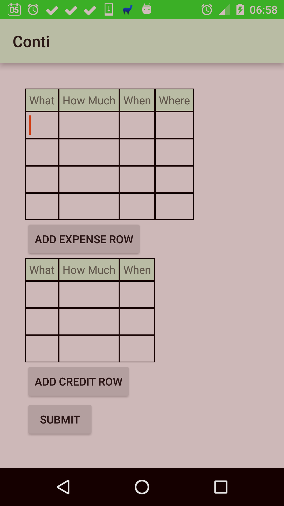

## Conti

Conti is a home expenses management tool: 
 * conti_app is the Android app (this one)
 * conti_ng is the web client [conti_ng](../../../conti_ng)
 * conti_gas is the backend part, in GoogleAppsScript: it retrieve data from Parse.com (which app and web client send data to), then populate a Spreadsheet with meanful data; finally, the spreadsheet formulas gives results and charts - it is still in development
 
The Android app uses ButterKnife for views injection, and Maven as building tool.

